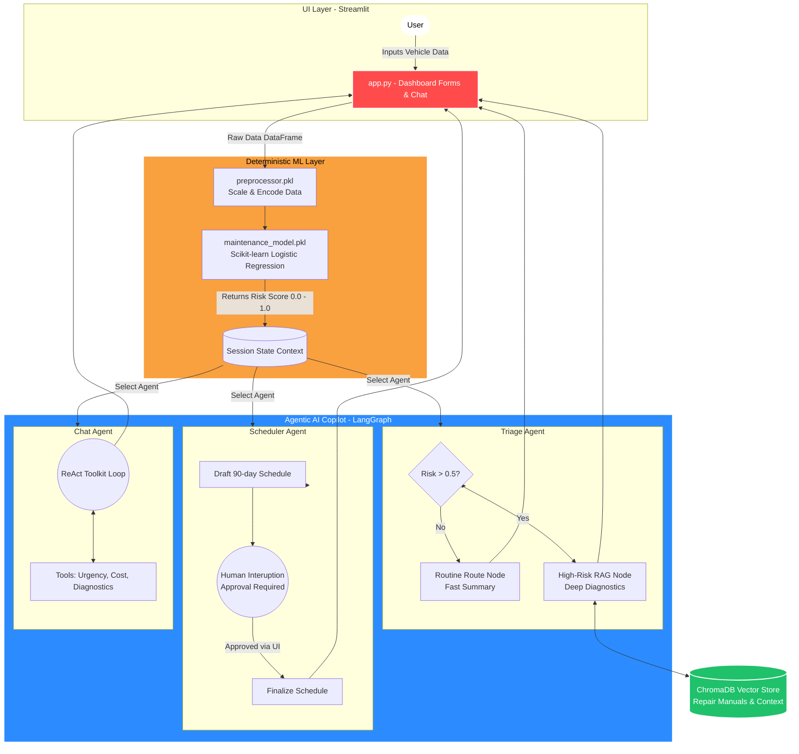

# 🚗 Vehicle Maintenance AI

[]()
[]()
[]()
[]()

> **Predictive Machine Learning meets Agentic Decision Support**

A modern, SaaS-style predictive maintenance platform that combines **traditional Machine Learning** (for risk scoring) with **Agentic AI** (for automated triaging, scheduling, and chatting). Built with Streamlit, Scikit-Learn, and LangGraph.

---

## 🌟 The Vision

Fleet managers and vehicle owners often struggle to balance maintenance costs with vehicle safety. This application solves that by creating a seamless pipeline:
1. **Predict** the exact risk of breakdown using Machine Learning.
2. **Analyze & Triage** using an Agentic AI workflow.
3. **Take Action** by generating manager-approved schedules and answering complex maintenance queries.

---

## ⚙️ How It Works: The Architecture

For a deep-dive into the step-by-step logic, check out [HOW_IT_WORKS.md](HOW_IT_WORKS.md).

### Architecture & Data Flow



### 1. The ML Layer (The "Brain")
Users input vehicle data (Age, Mileage in meters, Engine Size, Component conditions, etc.). A trained Scikit-Learn model (`maintenance_model.pkl`) evaluates this data and outputs a **Risk Score (0.0 to 1.0)**. 
* **< 0.50:** Routine Route ✅
* **>= 0.50:** High-Risk Route ⚠️

### 2. The AI Copilot Layer (The "Agents")
Once a Risk Score is generated, the vehicle context is passed to the **AI Copilot**, powered by LangChain and LangGraph. It consists of specialized workflows:

*   **🩺 Agent 1: The Triage Specialist (Conditional Routing):** Bypasses heavy processing for low-risk vehicles, but triggers a deeper RAG (Retrieval-Augmented Generation) search for high-risk vehicles to generate critical action reports.
*   **📅 Agent 2: The Master Scheduler (Human-in-the-Loop):** Drafts a 90-day maintenance schedule, but **pauses** execution to wait for Human (Manager) approval before finalizing the plan.
*   **💬 Agent 3: The Toolkit Chatbot (ReAct pattern):** An autonomous Chat Agent that accesses predefined tools (Cost Estimator, Urgency Checker) to synthesize exact answers for the user.
*   **🌐 Agent 4: The Fleet Strategist:** Aggregates data from the entire fleet to generate high-level business intelligence reports.

---

## 🛠 Tech Stack

* **Frontend:** Streamlit 
* **Machine Learning:** Scikit-Learn, Pandas, NumPy, Joblib
* **Agentic AI:** LangGraph, LangChain, LangChain-Groq
* **Vector Database:** ChromaDB, Sentence-Transformers
* **LLM Provider:** Groq (Llama-3) & OpenAI

---

## 🚀 Quick Start (Local Setup)

### 1. Clone & Navigate
```bash
git clone https://github.com/viruchafale/VEHICLE-MAINTENACE-AI.git
cd VEHICLE-MAINTENACE-AI
```

### 2. Prepare Environment
```bash
# Create and activate venv
python3 -m venv .venv
source .venv/bin/activate  # On Windows: .venv\Scripts\activate

# Install dependencies
pip install -r requirements.txt
```

### 3. Configure Environment Variables
Create a `.env` file in the root directory:
```env
GROQ_API_KEY=your_groq_api_key
OPENAI_API_KEY=your_openai_api_key
```

### 4. Build Models & Databases (If needed)
```bash
python train.py
python build_chroma_db.py
```

### 5. Launch the Dashboard
```bash
streamlit run app.py
```

---

## 🤝 Contributing
Contributions are welcome! Please feel free to submit a Pull Request.

1. Fork the Project
2. Create your Feature Branch (`git checkout -b feature/AmazingFeature`)
3. Commit your Changes (`git commit -m 'Add some AmazingFeature'`)
4. Push to the Branch (`git push origin feature/AmazingFeature`)
5. Open a Pull Request

---
*Developed with ❤️ for smarter vehicle management.*
